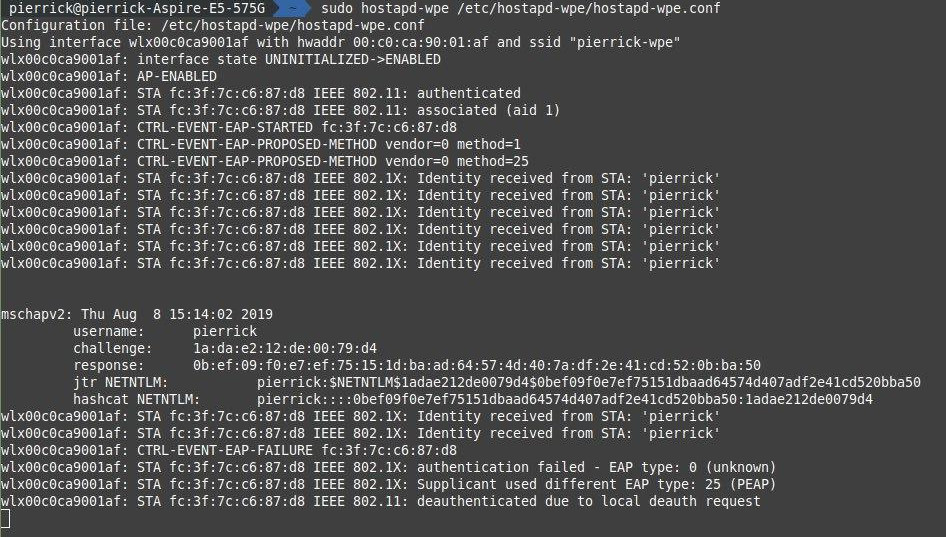
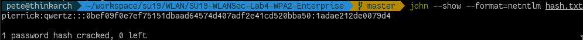

# Wireless Networks and Security

## WPA2 Enterprise Security

__Korean/Swiss hybrid teams are highly encouraged__

### For this first part, you will need to:

- Implement a WPE (Wireless Pwnage Edition) attack agains a WPA Enterprise network

No Scapy needed for this lab!

Please refer to the [MAC Security Lab](https://github.com/arubinst/SU19-WLANSec-Lab1-MAC) for important information about Monitor Mode, WiFi interfaces, etc.

## Your Work


### WPA2 Enterprise Attack

Networks using a WPA2 Enterprise authentication are considered today as very secure. Indeed, because the Master Key used to derive all other WPA keys is obtained from the authentication process, the dictionary and brute-force attacks used on WPA Personal are no longer applicable because we would need to try 2<sup>256</sup> combinations.

There are, however, other means to attack Enterprise networks, based on misconfiguration or bad implementation of WiFi clients.

By proposing an "evil twin", a victim can be attracted to connect to a fake network, allowing us to capture the inner authentication challenge. A brute-force attack can be perpetrated on this challenge. If the user has chosen a weak password, the attack can probably succeed. 

In some cases, we can even lead the victim to downgrade the authentication method, so that the credentials are actually transmitted in cleartext (i.e., no need to brute-force a hash).

For this attack to work, it may be necessary that the victim is configured to ignore certificate verification or that the victim accepts a new certificate when connecting. This is a common error made by users anyways.

How to run the attack:

- Install ```hostapd-wpe``` (if you are using Kali Linux, you probably already have a version installed. There may be different versions with slight variations on github...). When using Kali Linux, ```hostapd-wpe``` can be installed via ```apt-get```. 
- Read the documentation of the tools and other ressources on the Internet to understand how it works.
- Modify the ```hostapd-wpe``` configuration so that it proposes a network of your choice. For this exercise is might be better to create a completely fake non-existing network. If you're impersonating a network that is locally present/existing, it may be difficult to attract victims unless you have a powerful interface. You may try to deauthenticate your victim and hope that it will attempt to connect to your fake network instead. 
- Try to connect to your fake network (do not use real credentials!) and capture the challenge.
- Use a brute-forcing tool (```john```, ```asleap```, etc.) to attack the captured hash (use a simple password to minimise time).

### Answer the following questions :

> **_Question :_** What options did you have to modify in the hostapd-wpe configuration file in order to make the attack work ?
> 
> **_Answer:_** 
The SSID (for a custom one during the lab) and the interface name to use (corresponding to the USB Wireless Adaptator).
---

> **_Question:_** What type of hash did you capture ?
> 
> **_Answer:_** 
A NetNTLM hash.

---

> **_Question:_** Which authentication methods are supported by hostapd-wpe ?
> 
> **_Réponse:_**
- Open System Authentication
- Shared Key Authentication (requires WEP)


## In case of problems...

- Solution to the possible error " ```Could not configure driver mode``` " :

```
nmcli radio wifi off
rfkill unblock wlan
```


## Deliverables

Fork of the original repo. Then, a Pull Request containing:

- The names of the students. You can add this to the ```README.md```
- Screen grab of your activities + comments



- Answers to questions
